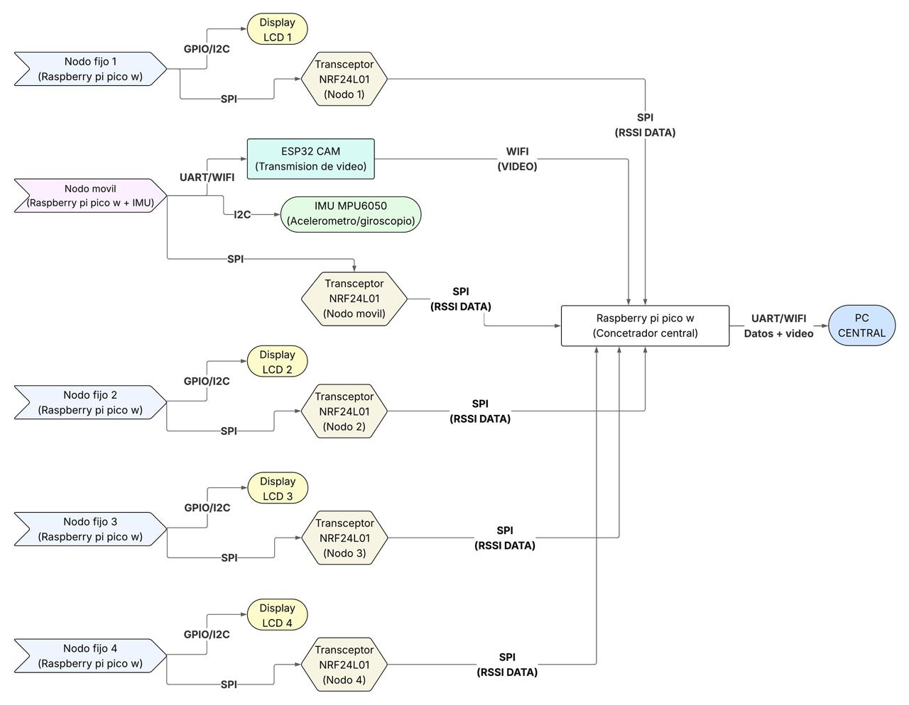

# Proyecto-Final-Localizaci-n-RSSI-Outdoor
# ComDigital-Outdoor

---

# 🛰️ Sistema de Trackeo en Tiempo Real para Carrito de Control Remoto

Este repositorio contiene el código fuente para un sistema distribuido de rastreo de un carrito de control remoto en tiempo real, usando tecnología NRF24L01, sensores inerciales (IMU), pantallas LCD e interconexión mediante módulos Raspberry Pi Pico W y ESP32-CAM.

## 🚗 Descripción del Proyecto

El proyecto permite monitorear en tiempo real la posición y movimiento de un carrito de control remoto utilizando una red de nodos fijos con transceptores NRF24L01 y un nodo móvil montado en el carrito con un sensor inercial (MPU6050). Un concentrador central recopila datos de RSSI (intensidad de señal recibida) desde los nodos y los envía, junto con datos de video y sensores, a una PC central para su procesamiento o visualización.

## 🧩 Componentes del Sistema

* **Nodo móvil**: Raspberry Pi Pico W + MPU6050 + NRF24L01 (envía datos de movimiento y RSSI).
* **Nodos fijos**: 4 Raspberry Pi Pico W + NRF24L01 + LCD para monitoreo local de señales RSSI.
* **Concentrador central**: Raspberry Pi Pico W que recopila datos de RSSI de todos los nodos y los envía a la PC.
* **ESP32-CAM**: Transmite video en tiempo real del carrito vía WiFi.
* **PC Central**: Recibe y visualiza datos del sistema.

## 🧠 Funcionalidades Clave

* Comunicación inalámbrica usando transceptores NRF24L01 vía SPI.
* Lectura de datos de acelerómetro y giroscopio (IMU MPU6050) vía I2C.
* Visualización local en pantallas LCD conectadas a nodos fijos.
* Transmisión de video del carrito mediante ESP32-CAM.
* Envío de todos los datos (video + sensores + RSSI) a la PC central por UART o WiFi.

## 🔧 Requisitos

* Python 3.x (para scripts en PC)
* Thonny / uPyCraft / Arduino IDE (para programar Pico W y ESP32-CAM)
* Bibliotecas: `machine`, `time`, `mpu6050`, `nrf24l01`, `lcd_api`, etc.

## 🚀 Instrucciones de Uso

1. **Flashea los scripts** en cada microcontrolador correspondiente.
2. **Configura la red NRF24L01** asegurando la dirección de cada nodo.
3. **Conecta el ESP32-CAM** a la red WiFi y habilita el stream de video.
4. **Ejecuta el script en la PC central** para visualizar y procesar los datos.

## 📸 Diagrama del Sistema

## 📌 Estado del Proyecto

✅ Diseño funcional completo
# Proyecto Final: Sistema de Localización en Espacio Abierto con Raspberry Pi Pico W

Este proyecto implementa un sistema de localización en tiempo real para un nodo móvil utilizando mediciones de Intensidad de Señal Recibida (RSSI) WiFi y datos de una Unidad de Medida Inercial (IMU). El sistema se basa en una red de Nodos Fijos, un Nodo Móvil que actúa como Punto de Acceso (AP), y un Nodo Concentrador que envía los datos a un computador para su procesamiento y visualización.

## Estructura del Proyecto

El sistema consta de los siguientes componentes principales y sus respectivos scripts:

1.  **Nodo Móvil AP (`mobile_node_ap_with_imu_server.py`):**
    *   Un Raspberry Pi Pico W que crea una red WiFi (Punto de Acceso).
    *   Lee datos de un sensor IMU MPU6050 (acelerómetro y giroscopio).
    *   Sirve los datos del IMU a través de un simple servidor HTTP en formato JSON.
    *   La señal WiFi de este AP es utilizada por los Nodos Fijos para las mediciones RSSI.

2.  **Nodos Fijos (`fixed_node_CONNECTED_scanner_with_nrf_tx_AND_OLED.py`):**
    *   Múltiples Raspberry Pi Pico W (típicamente 4) ubicados en posiciones conocidas.
    *   Cada Nodo Fijo se conecta a la red WiFi creada por el Nodo Móvil AP.
    *   Mide la intensidad de la señal (RSSI) de su conexión activa con el AP.
    *   Muestra su ID de nodo y el RSSI medido en una pantalla OLED local (opcional).
    *   Transmite su ID y el valor RSSI a un Nodo Concentrador utilizando un transceptor NRF24L01.

3.  **Nodo Concentrador (`concentrator_node_nrf_rx.py`):**
    *   Un Raspberry Pi Pico W que recibe los paquetes de datos (ID de nodo y RSSI) de todos los Nodos Fijos a través de un transceptor NRF24L01.
    *   Reenvía estos datos por la conexión serial USB a un computador.

4.  **Script de PC (`pc_data_receiver_ALL_ENHANCEMENTS_vX.py`):**
    *   Un script de Python que se ejecuta en un computador.
    *   Recibe los datos RSSI del Concentrador vía serial.
    *   Recibe los datos IMU del Nodo Móvil AP vía HTTP.
    *   Convierte los valores RSSI a estimaciones de distancia utilizando un modelo de propagación FSPL calibrado.
    *   Aplica filtros EMA a las distancias y a la posición final para suavizar.
    *   Realiza trilateración (o multilateración) para estimar la posición del Nodo Móvil.
    *   Visualiza en tiempo real la posición de los nodos, la trayectoria del móvil, los círculos de distancia, la calidad de la localización y los datos del IMU usando Matplotlib.
    *   Guarda un log detallado de la sesión en un archivo CSV.

## Requisitos de Hardware

*   **Nodo Móvil AP:**
    *   Raspberry Pi Pico W
    *   Sensor IMU MPU6050
*   **Nodos Fijos (xN, se recomiendan 4):**
    *   Raspberry Pi Pico W
    *   Módulo NRF24L01
    *   (Opcional) Pantalla OLED SSD1306 I2C
*   **Nodo Concentrador:**
    *   Raspberry Pi Pico W
    *   Módulo NRF24L01
*   **PC:**
    *   Conexión WiFi (para conectarse al AP del Nodo Móvil y recibir datos IMU).
    *   Puerto USB (para conectar al Nodo Concentrador y recibir datos RSSI).
*   Cables, protoboards o PCBs diseñados, fuentes de alimentación/baterías.

## Requisitos de Software

*   **Para Picos W:**
    *   Firmware MicroPython para Raspberry Pi Pico W.
    *   Librerías MicroPython:
        *   `nrf24l01.py` (para los Nodos Fijos y el Concentrador).
        *   `mpu6050.py` (para el Nodo Móvil AP).
        *   `ssd1306.py` (para los Nodos Fijos con OLED).
    *   Thonny IDE o herramienta similar para cargar scripts a los Picos.
*   **Para PC:**
    *   Python 3.x.
    *   Librerías de Python (instalar con `pip install <libreria>`):
        *   `pyserial`
        *   `numpy`
        *   `matplotlib`
        *   `requests`

## Configuración y Uso

### 1. Preparación de los Picos W

1.  **Nodo Móvil AP (`mobile_node_ap_with_imu_server.py`):**
    *   Asegurar que la librería `mpu6050.py` esté en el Pico.
    *   Verificar y ajustar los pines I2C para el MPU6050 (`I2C_BUS_ID`, `SDA_PIN_NUM`, `SCL_PIN_NUM`) en el script.
    *   Configurar `AP_SSID` y `AP_PASSWORD` si se desean diferentes.
    *   Cargar el script al Pico W del Nodo Móvil. Al ejecutar, creará la red WiFi y comenzará a servir datos IMU en su IP (usualmente `http://192.168.4.1/`).

2.  **Nodos Fijos (`fixed_node_CONNECTED_scanner_with_nrf_tx_AND_OLED.py`):**
    *   Asegurar que las librerías `nrf24l01.py` y `ssd1306.py` (si se usa OLED) estén en cada Pico Fijo.
    *   **Para cada Nodo Fijo, asignar un `NODE_ID` único (0, 1, 2, 3) en el script.**
    *   Verificar y ajustar los pines SPI para el NRF24L01 y los pines I2C para la OLED.
    *   Asegurar que los parámetros NRF (`NRF_CHANNEL_CONFIG`, `NRF_DATARATE_CONFIG`, `NRF_PA_LEVEL_CONFIG`, `PIPE_ADDR_NRF`, `PAYLOAD_SIZE_NRF`) sean idénticos a los del Nodo Concentrador.
    *   Asegurar que `TARGET_SSID` y `TARGET_PASSWORD` coincidan con los del AP Móvil.
    *   Cargar el script modificado a cada Pico W Nodo Fijo.

3.  **Nodo Concentrador (`concentrator_node_nrf_rx.py`):**
    *   Asegurar que la librería `nrf24l01.py` esté en el Pico.
    *   Verificar y ajustar los pines SPI para el NRF24L01.
    *   Asegurar que los parámetros NRF (`NRF_CHANNEL_CONFIG`, `NRF_DATARATE_CONFIG`, `PIPE_ADDR_NRF`, `PAYLOAD_SIZE_NRF`) sean idénticos a los de los Nodos Fijos.
    *   Cargar el script al Pico W Concentrador.

### 2. Calibración del Sistema (Script de PC)

Antes de obtener localizaciones precisas, es crucial calibrar el modelo RSSI-distancia:

1.  **Coordenadas de Nodos Fijos:** Mida con precisión las coordenadas (x,y) en metros de cada Nodo Fijo en su área de prueba y actualice `NODOS_FIJOS_COORDS` en el script de PC.
2.  **Frecuencia del AP Móvil:** Determine el canal WiFi en el que opera su AP Móvil (puede escanearlo o intentar configurarlo en el script del AP). Actualice `FREQ_MHZ` en el script de PC con la frecuencia central de ese canal (ej. Canal 6 = 2437 MHz).
3.  **Medición RSSI a 1 Metro:** Coloque el AP Móvil a 1 metro de un Nodo Fijo de referencia. Registre el promedio de las lecturas RSSI estables.
4.  **Cálculo de `P_TX_DBM` y `K_FACTOR_DB`:**
    *   Haga una suposición inicial para `P_TX_DBM` (ej. 15 dBm).
    *   Calcule `FSPL(1m) = 20*log10(0.001) + 20*log10(FREQ_MHZ) + 32.44`.
    *   Calcule `K_FACTOR_DB = RSSI_experimental(1m) - (P_TX_DBM - FSPL(1m))`.
    *   Actualice estos valores en el script de PC.
    *   Valide el modelo midiendo RSSI a otras distancias conocidas. Si las distancias estimadas son consistentemente erróneas, ajuste `P_TX_DBM` y recalcule `K_FACTOR_DB` hasta obtener el mejor ajuste general.

### 3. Ejecución del Sistema Completo

1.  Encienda todos los Nodos Pico W (AP Móvil, Fijos, Concentrador).
2.  Conecte el Pico W Concentrador al PC vía USB.
3.  Conecte el PC a la red WiFi "NodoMovil\_Proyecto" creada por el AP Móvil.
4.  Verifique y actualice el `SERIAL_PORT` en el script de PC al puerto COM o /dev/tty\* correcto del Concentrador.
5.  Ejecute el script de PC (ej. `python pc_data_receiver_ALL_ENHANCEMENTS_v5_final_documented.py`).
    *   Se abrirá una ventana de Matplotlib mostrando la localización estimada del Nodo Móvil y los datos del IMU.
    *   Un archivo CSV con datos detallados de la sesión se guardará en el mismo directorio que el script.

## Estructura del Código Principal (Script de PC)

*   **Parámetros de Configuración y Calibración:** Variables para el puerto serial, coordenadas de nodos fijos, y parámetros del modelo RSSI-distancia.
*   **Configuración IMU:** URL para obtener datos IMU y variables para su manejo.
*   **Almacenamiento y Filtros:** Diccionarios para datos RSSI, parámetros de timeout, y variables para la posición cruda y filtrada (EMA).
*   **Log CSV:** Configuración para guardar datos de la sesión.
*   **Funciones de Cálculo:**
    *   `rssi_a_distancia_FSPL()`: Convierte RSSI a metros.
    *   `trilateracion_min_cuadrados()`: Calcula la posición 2D.
*   **Hilo IMU (`fetch_imu_data_thread_func`):** Obtiene datos del IMU en segundo plano.
*   **Configuración Matplotlib:** Prepara la figura y los subplots para la visualización.
*   **`conectar_serial()`:** Establece la comunicación con el Pico Concentrador.
*   **`actualizar_plot()`:** Función principal llamada por `FuncAnimation`. Realiza:
    1.  Lectura de datos RSSI seriales.
    2.  Aplicación de filtro EMA a distancias individuales.
    3.  Preparación de datos para trilateración (usando distancias EMA).
    4.  Actualización de círculos de distancia y texto informativo.
    5.  Cálculo de la posición cruda mediante trilateración.
    6.  Aplicación de filtro EMA a la posición cruda.
    7.  Actualización del indicador de calidad de localización (basado en número de nodos y std dev de distancias).
    8.  Actualización del plot del nodo móvil y su trayectoria.
    9.  Actualización de los plots del IMU.
    10. Guardado de datos en el archivo CSV.
*   **Bloque `if __name__ == "__main__":`**: Inicia la conexión serial, el hilo IMU, y la animación de Matplotlib. Maneja la limpieza al cerrar.

## Posibles Mejoras Futuras
*   Implementación de un Filtro de Kalman Extendido (EKF) para fusionar datos RSSI e IMU de manera más robusta.
*   Auto-detección del canal WiFi del AP Móvil.
*   Un servidor HTTP más robusto en el Pico W AP para los datos IMU.
*   Mecanismos de auto-reconexión más avanzados para los Nodos Fijos.

---
🔄 Mejoras en optimización de código y visualización en curso

## 🤝 Contribuciones

¡Bienvenid@s! Puedes enviar pull requests o abrir issues para sugerencias o mejoras.

---
